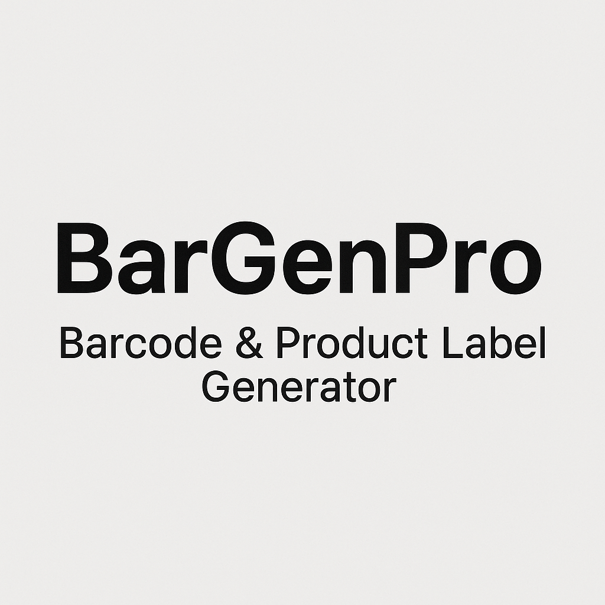
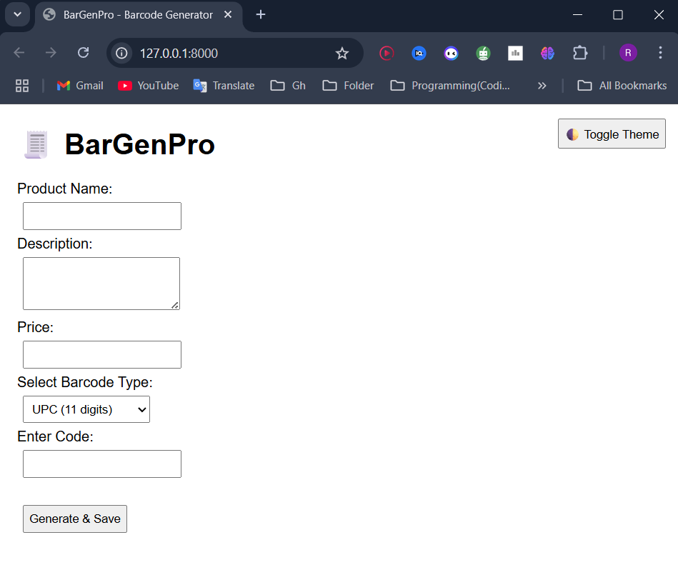
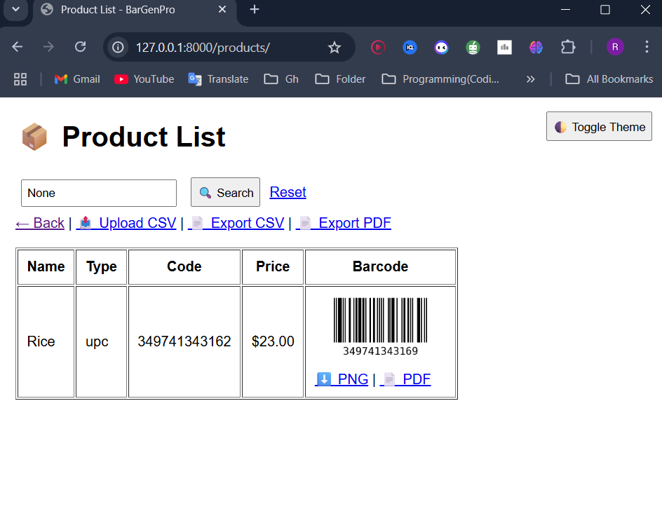
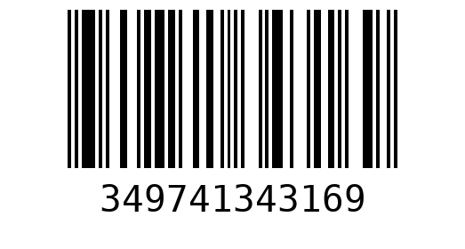
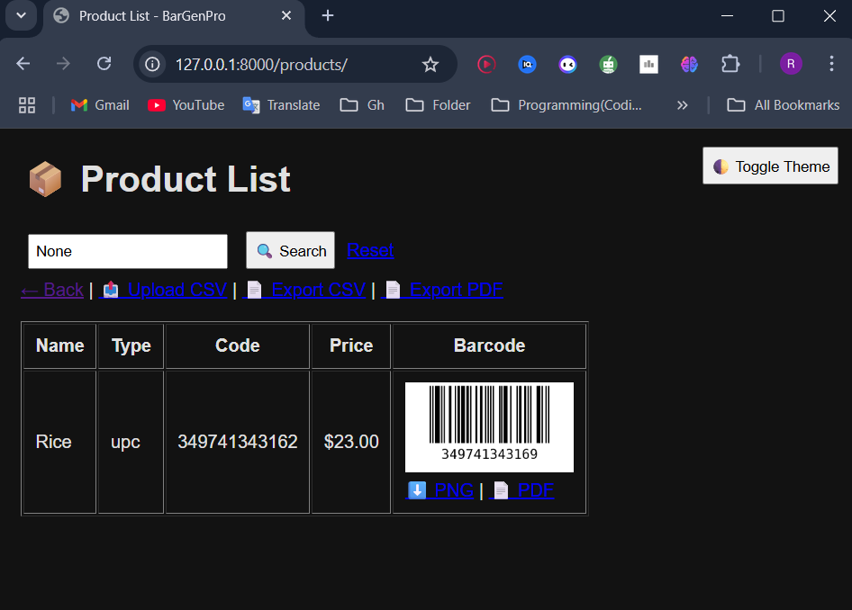

<p align="center">
  
</p>

<h1 align="center">BarGenPro - Barcode & Product Label Generator (Django)</h1>
<p align="center"><b>A complete solution to generate, manage, and export barcodes with Django</b></p>

BarGenPro is a web-based platform built with Django and Python that allows users to generate barcodes (PNG & PDF), manage products, upload bulk CSVs, switch between dark/light mode, and export product data. Designed for small businesses, retail mockups, libraries, and inventory systems.

---

## 🚀 Features

- ✅ Generate barcodes in various formats (UPC, EAN, ISBN, Code128, etc.)
- ✅ Automatically save product details with barcode image
- ✅ PNG & PDF download support for each barcode
- ✅ Batch barcode generation via CSV file upload
- ✅ Search and filter through all products
- ✅ Export all products to CSV or PDF
- ✅ Toggle between Dark/Light themes
- ✅ Admin dashboard with Django backend

---

## 📸 Screenshots

### 🏠 Homepage
<p align="center">
  
</p>

### 📋 Product List View
<p align="center">
  
</p>

### 🧾 Barcode Preview (PNG & PDF Download)
<p align="center">
  
</p>

### 🌙 Dark Mode Enabled
<p align="center">
  
</p>

---

## 📁 Project Structure

```

BarGenPro/
├── barcodegen/
│   ├── templates/barcodegen/
│   ├── static/barcodegen/
│   ├── models.py
│   ├── views.py
│   ├── urls.py
│   └── admin.py
├── media/barcodes/          # Saved barcode images
├── static/                  # Global static files (CSS, etc.)
├── bargenpro/               # Project settings
├── db.sqlite3
├── manage.py
└── README.md

````

---

## ⚙️ Technologies Used

- 🐍 Python 3.x
- 🌐 Django 5.2
- 📦 python-barcode
- 🖼️ Pillow (image support)
- 🧾 reportlab (PDF generation)
- 🧠 HTML5, CSS3
- 🌓 JavaScript for theme toggle

---

## 📂 How to Run This Project

1. **Clone the repository:**
```
   git clone https://github.com/yourusername/BarGenPro.git
   cd BarGenPro
```

2. **Set up virtual environment:**

   ```
   python -m venv venv
   source venv/bin/activate  # or venv\\Scripts\\activate on Windows
   pip install -r requirements.txt
   ```

3. **Apply migrations:**

   ```
   python manage.py migrate
   ```

4. **Create superuser (admin login):**

   ```
   python manage.py createsuperuser
   ```

5. **Run the development server:**

   ```
   python manage.py runserver
   ```

6. **Visit the app at:**

   ```
   http://127.0.0.1:8000/
   ```

---

## 👤 Admin Panel

* Access: `/admin/`
* Login with the superuser credentials you create.

---

## 📤 CSV Format Example

```
name,description,price,code_type,code_value
Book A,Science Book,99.99,ean13,590123412345
Bottle,Reusable Water Bottle,15.00,upc,12345678901
Notebook,Stationery,8.50,code128,ABC123456
```

---

## ✅ Future Improvements (Planned)

* ✅ Mobile responsive layout
* ✅ ZIP download of all barcodes
* ✅ Barcode scanner integration
* ✅ User authentication for saved history
* ✅ Sorting & pagination

---

# Credits

Built with using Django by **Md Rakibul Hassan**

CSE Undergraduate | Backend Developer | Robotics & IoT Enthusiast

🔗 [LinkedIn](https://www.linkedin.com/in/md-rakibul-hassan-507b00308)

🐙 [GitHub](https://github.com/RR0327)

Designed to help users visualize complex data through customizable heatmaps and track real-time weather conditions interactively. 

## 📄 License

This project is licensed under the [MIT License](LICENSE).

---

## 🤝 Contributing

Pull requests and suggestions are welcome! Feel free to open an issue or fork the repo.

---
