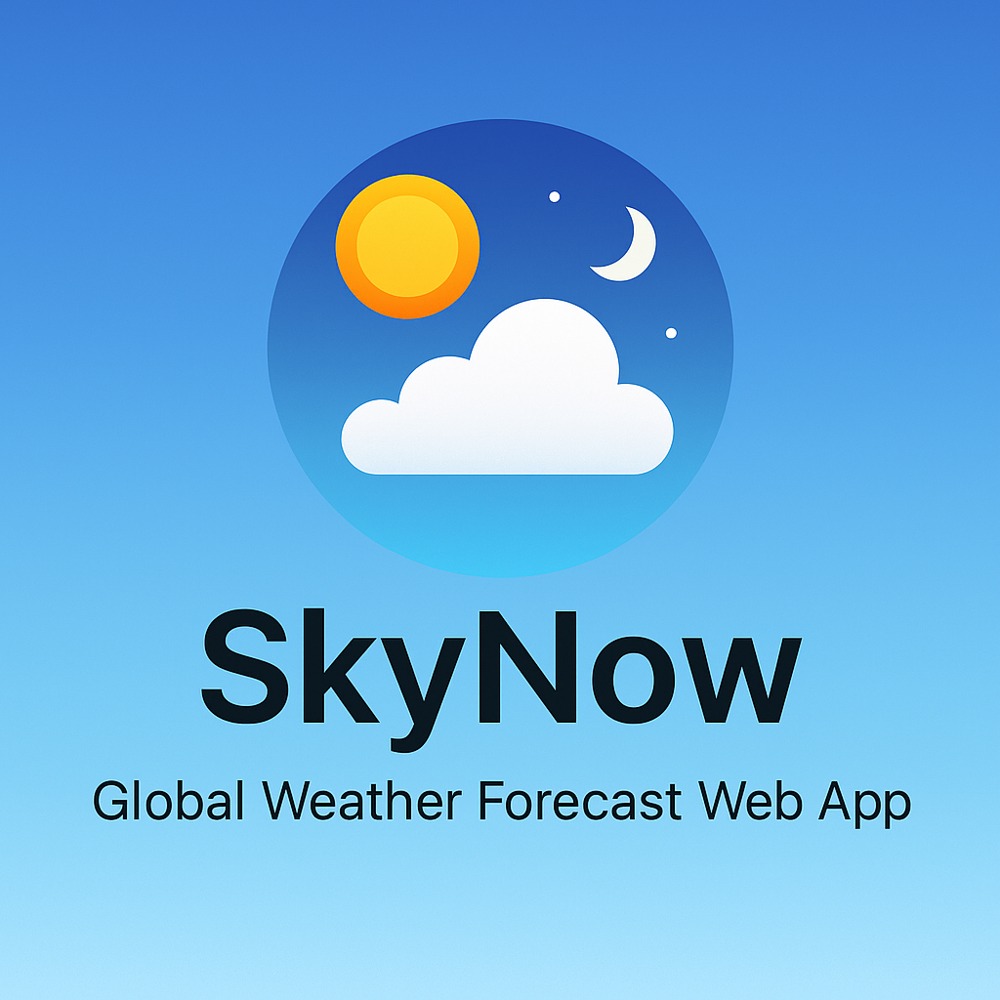

<!-- Full-width high-quality image -->
<p align="center">
  
</p>

## <h1 align="center">SkyNow — Global Weather Forecast Web App</h1>

*SkyNow* is a Django-based weather application that provides **real-time weather information** for any city in the world. It includes temperature, condition, sunrise/sunset times, export options, search history, fuzzy city matching, and a dynamic temperature trend chart.

---

## 🚀 Features

| Feature               | Description                                                                 |
|----------------------|-----------------------------------------------------------------------------|
| 🌐 **Global Support**    | Search weather using any country/city combination globally               |
| 💾 **Search History**    | View your latest 5 searches stored in the database                         |
| 📊 **Live Weather Info** | Scrapes real-time weather (temp + condition) from [timeanddate.com](https://www.timeanddate.com/weather/) |
| 🌅 **Sunrise/Sunset**    | View daily sunrise and sunset times for your selected city                 |
| 🧠 **Smart Suggestions** | Auto-correct city names with fuzzy matching support                         |
| 📤 **Export Data**       | Download weather info in .json or .txt format                          |
| 📈 **Trend Chart**       | Plot recent temperature trends using matplotlib                          |
| 🖥️ **Web UI**            | Fully interactive interface with no GUI dependencies                       |

---

## 🛠️ Tech Stack

- **Backend**: Python, Django
- **Scraping**: BeautifulSoup4, requests
- **Smart Matching**: fuzzywuzzy
- **Charting**: matplotlib (with Agg backend)
- **Database**: SQLite3 (default with Django)
- **Frontend**: HTML + vanilla CSS (Bootstrap/Tailwind optional)
- **Hosting**: Localhost (Deployment-ready)

---

## 🔧 Setup Instructions

### 1. Clone the Repo
```
git clone https://github.com/yourusername/skynow.git
cd skynow
```

### 2. Create & Activate Virtual Environment
```
python -m venv venv
source venv/bin/activate    # On Windows: venv\Scripts\activate
```

### 3. Install Requirements
```
pip install -r requirements.txt
```

> If you don’t have requirements.txt, manually install:
```
pip install django requests beautifulsoup4 fuzzywuzzy python-Levenshtein matplotlib
```

### 4. Run Migrations
```
python manage.py makemigrations
python manage.py migrate
```

### 5. Start Development Server
```
python manage.py runserver
```

## Visit: [http://127.0.0.1:8000/](http://127.0.0.1:8000/)

---

## 📁 Project Structure
```
skynow/
├── weather/
│   ├── templates/
│   │   └── weather/
│   │       ├── home.html
│   │       └── trend.html
│   ├── scraper.py
│   ├── views.py
│   ├── models.py
│   └── urls.py
├── skynow/
│   └── urls.py
├── db.sqlite3
└── manage.py
```

---

# Credits

Built with using Django by **Md Rakibul Hassan**

CSE Undergraduate | Backend Developer | Robotics & IoT Enthusiast

🔗 [LinkedIn](https://www.linkedin.com/in/md-rakibul-hassan-507b00308)

🐙 [GitHub](https://github.com/RR0327)

Designed to help users visualize complex data through customizable heatmaps and track real-time weather conditions interactively. 

# License

This project is open source and available under the MIT License.
