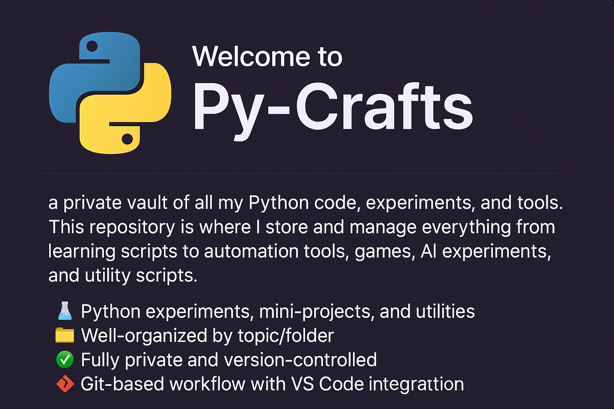

<p align="center">
  
</p>

<h1 align="center">Py-Crafts </h1>

Welcome to **Py-Crafts** — a private vault of all my Python code, experiments, and tools.  
This repository is where I store and manage everything from learning scripts to automation tools, games, AI experiments, and utility scripts.

---

## 📂 Structure

The repository is organized into the following categories:

```
py-crafts/
├── projects/
│   ├── automation/       # Python scripts for automating tasks
│   ├── scripts/          # Simple or utility-based Python programs
│   └── ai/               # AI and machine learning experiments
├── main.py               # Initial test or entry script
├── .gitignore            # Ignored files (e.g., cache, venv, etc.)
├── README.md             # You're reading it!
├── requirements.txt      # Dependencies list
└── venv/                 # Virtual environment (ignored)
```

---

## 🛠 Features

- 🧪 Python experiments, mini-projects, and utilities
- 📁 Well-organized by topic/folder
- 🔐 Fully private and version-controlled
- ✅ Git-based workflow with VS Code integration

---

## 🚀 Getting Started

To run any of the projects:

```
# Clone the repository
git clone https://github.com/your-username/py-crafts.git

# Navigate into it
cd py-crafts

# (Optional) Create a virtual environment
python -m venv venv
source venv/bin/activate  # On Windows: venv\Scripts\activate

# Install dependencies
pip install -r requirements.txt
```

---

## 🤖 Tech Stack

- **Python 3.x**
- Django Framework
- DRF (Django REST Framework)
- Flask
- HTML + CSS +JS(beginner-friendly)

---

## 🔒 Private Repository

This repository is intended for personal use and will remain private.  
If made public in the future, a license and contribution guidelines will be added.

---
